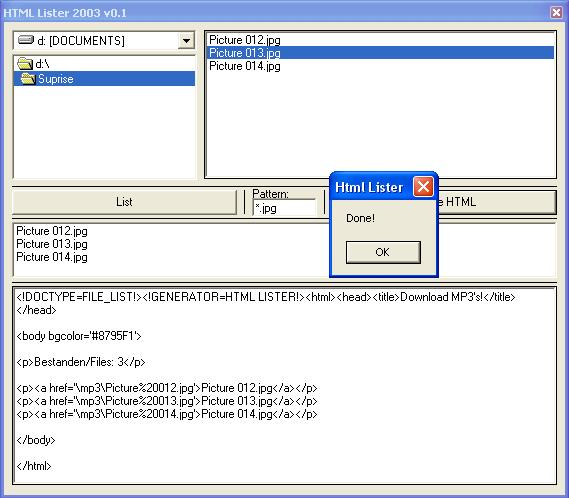



## HTML Lister \> List all files in a folder to an html file with links\!

### Description

This code takes all the filenames with the correct extension into a list, and makes an HTML page with hyperlinks to the files. If you dont get what I mean try it out, it's great if you'r hosting lots of files on your own webserver!
 
### More Info
 
If you have the files it needs to point to in a different directory than the root ("\") then you will need to change taht.

             |
---                |---
**Submitted On**   |2003-02-02 07:15:02
**By**             |[Jeroen van de Ven](https://github.com/Planet-Source-Code/PSCIndex/blob/master/ByAuthor/jeroen-van-de-ven.md)
**Level**          |Beginner
**User Rating**    |4.8 (19 globes from 4 users)
**Compatibility**  |VB 3\.0, VB 4\.0 \(16\-bit\), VB 4\.0 \(32\-bit\), VB 5\.0, VB 6\.0, VBA MS Excel
**Category**       |[Internet/ HTML](https://github.com/Planet-Source-Code/PSCIndex/blob/master/ByCategory/internet-html__1-34.md)
**World**          |[Visual Basic](https://github.com/Planet-Source-Code/PSCIndex/blob/master/ByWorld/visual-basic.md)
**Archive File**   |[HTML\_Liste153806222003\.zip](https://github.com/Planet-Source-Code/jeroen-van-de-ven-html-lister-list-all-files-in-a-folder-to-an-html-file-with-links__1-42882/archive/master.zip)

